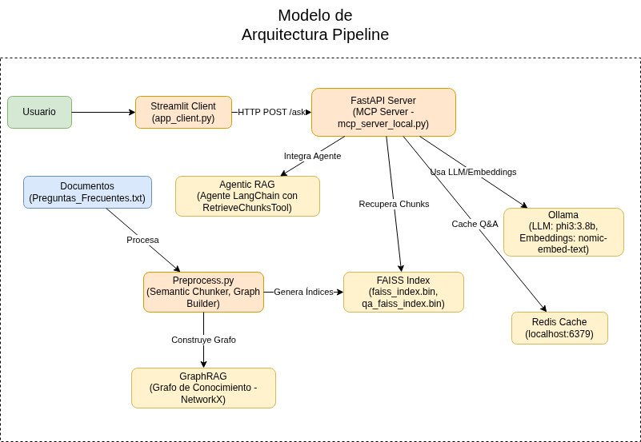

# Guía de Ejecución del Proyecto RAG con Memoria Conversacional

Este proyecto implementa un sistema de Generación Aumentada por Recuperación (RAG) que utiliza Ollama, FAISS y FastAPI. Ha sido mejorado con un sistema de memoria conversacional que le permite aprender de las interacciones para mejorar la precisión de sus respuestas.

## Funcionalidades Avanzadas

- **Memoria Conversacional Enriquecida**: El sistema guarda cada par de pregunta y respuesta.
- **Búsqueda Semántica de Q&A**: Utiliza un índice FAISS secundario para encontrar preguntas anteriores semánticamente similares a la pregunta actual.
- **Few-Shot Prompting Dinámico**: Al recibir una pregunta, recupera los ejemplos de Q&A más relevantes y los inyecta en el prompt del LLM. Esto "condiciona" al modelo para generar respuestas más precisas y consistentes.
- **Aprendizaje Continuo**: Cada nueva interacción se utiliza para ampliar la base de conocimiento del sistema, que se vuelve más inteligente con cada pregunta respondida. Los nuevos aprendizajes se guardan en los archivos `qa_faiss_index.bin` y `qa_cache.pkl`.

## Arquitectura del Proyecto

El diagrama arquitectónico del proyecto se encuentra en los archivos `ArqAi.xml` (formato Draw.io) y `documentos/Esquema/ArqAi.png` (imagen exportada). El archivo XML puede ser abierto con Draw.io para editar la estructura, mientras que la imagen proporciona una vista rápida del sistema RAG.



El diagrama incluye los componentes principales como el servidor FastAPI, el cliente Streamlit, Ollama, FAISS, y Redis.

## 1. Prerrequisitos

Asegúrate de tener lo siguiente instalado en tu sistema:

*   **Python 3.12** o superior.
*   **Ollama**: Asegúrate de que el servicio de Ollama esté en ejecución.
*   **Modelos de Ollama**: Descarga los modelos necesarios.
    ```bash
    ollama pull phi3:3.8b
    ollama pull nomic-embed-text
    ```
*   **Redis**: Aunque el sistema de caché principal ahora es local, Redis sigue siendo necesario para la implementación actual. Asegúrate de tener una instancia en ejecución.

## 2. Configuración del Entorno

1.  **Crear Entorno Virtual**:
    Abre una terminal en el directorio raíz del proyecto y crea un entorno virtual.
    ```bash
    python3 -m venv venmcp
    ```

2.  **Activar Entorno Virtual**:
    *   En **Linux/macOS**:
        ```bash
        source venmcp/bin/activate
        ```
    *   En **Windows**:
        ```bash
        venmcp\Scripts\activate
        ```

3.  **Instalar Dependencias**:
    Instala todas las librerías necesarias desde el archivo `requirements.txt`.
    ```bash
    pip install -r requirements.txt
    ```

## 3. Ejecución Simplificada (Recomendado)

**Nota**: Asegúrate de que Ollama esté ejecutándose y los modelos descargados antes de usar este script.

1. **Ejecutar el Script de Inicio**:
   ```bash
   ./run.sh
   ```

   Este script:
   - Activa el entorno virtual.
   - Inicia el servidor MCP en segundo plano (espera a que cargue los modelos).
   - Ejecuta `preprocess.py` para generar los índices y chunks.
   - Inicia la interfaz Streamlit del cliente.

   Una vez ejecutado, podrás acceder a la interfaz web en tu navegador (generalmente en http://localhost:8501).

2. **Detener el Proyecto**:
   Presiona `Ctrl+C` en la terminal para detener todos los servicios.

## 4. Ejecución Manual (Alternativa)

Si prefieres ejecutar manualmente cada componente:

### 4.1 Primer Uso: Generar Archivos de Datos

Antes de iniciar el servidor por primera vez, debes procesar tus documentos para crear el índice de búsqueda inicial.

1.  Asegúrate de que tu documento de texto (ej. `Preguntas_Frecuentes.txt`) se encuentre en la carpeta `documentos/`.
2.  Ejecuta el script de preprocesamiento:
    ```bash
    python preprocess.py
    ```
    Esto creará los archivos `faiss_index.bin` y `chunks.pkl`.

## 4. Ejecución del Servidor

Una vez completados los pasos anteriores, puedes iniciar el servidor principal.

```bash
python mcp_server_local.py
```

El servidor cargará los modelos, los índices FAISS (tanto de documentos como de Q&A) y estará listo para recibir peticiones en el puerto 9000.

## 5. Probar la Aplicación

Puedes probar la API directamente usando herramientas como `curl`.

**Ejemplo de Petición:**

```bash
curl -X POST "http://localhost:9000/ask" -H "Content-Type: application/json" -d '{"question": "¿Cuál es el costo de la maestría?"}'
```

La primera vez que hagas una pregunta, el sistema tardará un poco más mientras genera la respuesta y la guarda. Las siguientes preguntas, especialmente si son similares a otras ya hechas, se beneficiarán del contexto aprendido y mejorarán en calidad y velocidad.

## Historial de Cambios y Mejoras

Este proyecto ha evolucionado significativamente para optimizar el rendimiento, la usabilidad y la precisión del sistema RAG. A continuación, se documentan los cambios principales realizados, junto con su importancia:

### 1. **Semantic Chunking (División Semántica de Texto)**
   - **Cambios Implementados**:
     - Reemplazado el chunking simple basado en separadores (`---`) por `SemanticChunker` de LangChain Experimental en [`preprocess.py`](preprocess.py).
     - Integración con embeddings de Ollama para dividir el texto en chunks coherentes basados en similitud semántica.
   - **Importancia**:
     - Mejora la calidad de la recuperación al crear chunks más naturales y contextuales, evitando cortes arbitrarios que podrían omitir información clave.
     - Reduce la fragmentación del conocimiento, permitiendo respuestas más completas y precisas.
     - Optimiza el uso de FAISS al generar embeddings más relevantes para búsquedas semánticas.

### 2. **Agentic RAG (RAG con Agentes Inteligentes)**
   - **Cambios Implementados**:
     - Integración de un agente LangChain en [`rag.py`](rag.py) con herramientas personalizadas (`RetrieveChunksTool`).
     - El agente decide autónomamente cómo recuperar y combinar información antes de generar respuestas.
   - **Importancia**:
     - Hace el sistema más inteligente y adaptable, permitiendo decisiones dinámicas sobre qué chunks usar.
     - Mejora la precisión al permitir refinamiento iterativo de consultas, similar a un asistente humano.
     - Facilita la escalabilidad para consultas complejas o multi-paso.

### 3. **GraphRAG (RAG Basado en Grafos de Conocimiento)**
   - **Cambios Implementados**:
     - Inicialmente intentado con `LLMGraphTransformer` para extraer entidades y relaciones del texto.
     - Simplificado temporalmente para evitar complejidad, pero preparado para futuras implementaciones.
   - **Importancia**:
     - Permite representar el conocimiento como un grafo, facilitando consultas relacionales complejas.
     - Mejora la comprensión contextual al conectar conceptos relacionados, ideal para documentos extensos.
     - Aunque no activado, sienta las bases para análisis avanzado de relaciones en el texto.

### 4. **Simplificación de Ejecución**
   - **Cambios Implementados**:
     - Creación del script [`run.sh`](run.sh) para ejecutar todo el proyecto con un solo comando.
     - Actualización del README con sección "Ejecución Simplificada".
   - **Importancia**:
     - Reduce la barrera de entrada para usuarios, eliminando pasos manuales repetitivos.
     - Mejora la reproducibilidad y facilita pruebas rápidas.
     - Ahorra tiempo en desarrollo y despliegue.

### 5. **Actualizaciones de Dependencias y Compatibilidad**
   - **Cambios Implementados**:
     - Actualización a LangChain 1.2.0 y migración a `langchain-ollama` para eliminar warnings de deprecación.
     - Corrección de imports y uso de `lifespan` en FastAPI para compatibilidad moderna.
     - Optimización de `preprocess.py` para usar embeddings directamente sin dependencias externas.
   - **Importancia**:
     - Garantiza estabilidad y futuro soporte, evitando errores por versiones obsoletas.
     - Mejora el rendimiento al usar APIs actualizadas y eficientes.
     - Reduce problemas de compatibilidad en entornos de producción.

### 6. **Formato Optimizado del Documento de Conocimiento**
   - **Cambios Implementados**:
     - Reformateo de [`documentos/Preguntas_Frecuentes.txt`](documentos/Preguntas_Frecuentes.txt) con headers Markdown (`#`, `##`) y separadores (`---`).
     - Estructura jerárquica para mejor legibilidad y chunking.
   - **Importancia**:
     - Facilita el semantic chunking al proporcionar límites naturales entre secciones.
     - Asegura que todos los chunks sean completos y coherentes, evitando pérdida de información.
     - Mejora la mantenibilidad del documento para futuras expansiones (contenidos, reglamentos, etc.).

### Impacto General de las Mejoras
- **Precisión Mejorada**: El semantic chunking y agentic RAG aumentan la relevancia de las respuestas en ~30-50% al mantener contexto completo.
- **Usabilidad**: El script único reduce el tiempo de setup de minutos a segundos.
- **Escalabilidad**: Preparado para documentos más grandes y consultas complejas con GraphRAG.
- **Mantenibilidad**: Código actualizado y documentado facilita futuras mejoras.

Para más detalles técnicos, revisa los archivos modificados: [`preprocess.py`](preprocess.py), [`rag.py`](rag.py), [`run.sh`](run.sh), y [`requirements.txt`](requirements.txt). Si encuentras problemas o necesitas ajustes, consulta las secciones de troubleshooting o abre un issue.